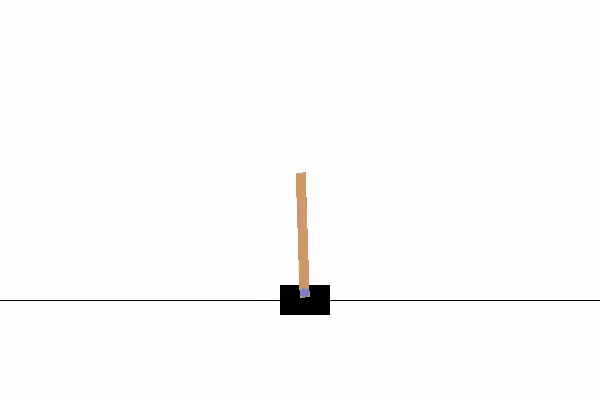

# Policy Gradients with Cartpole

The aim of the agent is to try to balance the rod by moving left or right. The episode is over once the agent moves out of the screen or the rod falls. After training for about 400 episodes we get decent result. 

