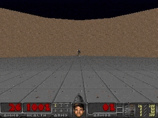

# Policy Gradients with Doom Defend the Center

Defend the Center involves a player with limited bullets right at the center and enemies spawning all around. It has to kill as many enemies as possible. Note that since bullets are limited death is inevitable. All the agent can do is take down as many enemies as he can before he dies.

With about 500 episodes the agent plays reasonably well, err except for some reason it thinks its good to shoot at nothing during the initial few seconds.

