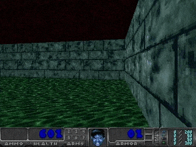

# Policy Gradients with Doom Health Gathering

The aim of the agent in this scenario is to survive for as long as you can. The health keeps falling at regular interval and agent can collect fallen healt box to fill his health by small amount thus delaying his death. 

With just 500 episodes the agent is able to understand that collecting health is good and is able to navigate for around 50-60 sec while random agent dies within 5 sec.

> The WAD and config file is present alongside the notebook and notebook fetches it in colab environment. All you need to do is to open notebook in colab and run all cells.

